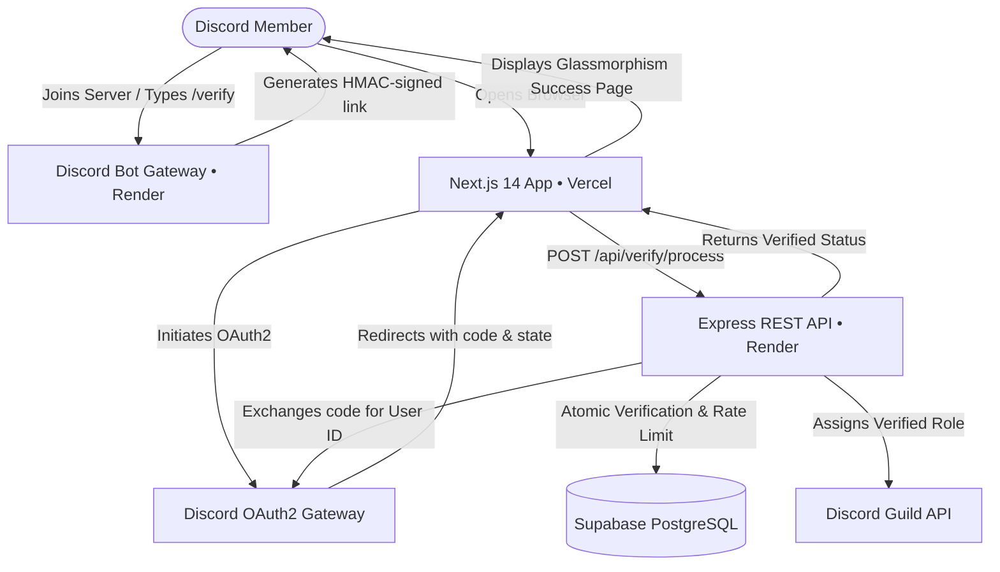

# 🛡️ Discord Member Verification Platform

A production-grade, decoupled Discord member verification system powered by **Next.js (Vercel)**, **Node.js Express + Discord.js Bot (Render Free Service)**, and **Supabase (PostgreSQL)**.

---

## 🏛️ Architecture Overview



---

## 📂 Project Structure

```
├── backend/                  # Deployed to Render (Node.js Web Service)
│   ├── src/
│   │   ├── api/             # REST API routes (/api/verify, /api/admin, /health)
│   │   ├── auth/            # OAuth token exchange & Admin JWT/Bearer auth
│   │   ├── bot/             # Discord.js v14 Bot & Event Listeners & Slash Commands
│   │   ├── config/          # Zod-validated environment config
│   │   ├── database/        # Supabase client & strongly-typed queries
│   │   ├── services/        # Discord role mutator (with retry & mutex) & rate limiter
│   │   ├── utils/           # Crypto helpers (HMAC tokens, SHA256 IP hashing)
│   │   └── verification/    # Core atomic verification state machine engine
│   ├── tests/               # Vitest unit & integration test suites
│   ├── package.json
│   ├── tsconfig.json
│   └── .env.example
│
├── frontend/                 # Deployed to Vercel (Next.js 14 App Router)
│   ├── src/
│   │   ├── app/
│   │   │   ├── page.tsx             # Landing & Add to Server page
│   │   │   ├── verify/              # Verification flow & result pages (Success, Failure, Expired, Already)
│   │   │   ├── auth/callback/       # OAuth callback page with cold-start awakening spinner
│   │   │   └── admin/               # Full responsive glassmorphic Admin Dashboard
│   │   ├── components/              # Header & Footer navigation
│   │   └── lib/api.ts               # Backend REST API client with auto-retry
│   ├── package.json
│   ├── tsconfig.json
│   └── .env.example
│
├── migrations/
│   └── 0001_init.sql         # Supabase PostgreSQL schema with RLS & indexes
├── PRD.md                    # Product Requirement Document
└── README.md
```

---

## 🚀 Deployment Guide

### 1. Database Setup (Supabase)
1. Create a free project on [supabase.com](https://supabase.com).
2. Go to **SQL Editor** &rarr; **New query**.
3. Paste and run the entire contents of [`migrations/0001_init.sql`](file:///c:/Users/soumy/Documents/Discord%20Verification%20BOT/migrations/0001_init.sql).
4. Go to **Project Settings &rarr; API** and copy:
   - `Project URL`
   - `service_role` secret key (under Project API keys).

---

### 2. Backend Deployment (Render Free Web Service)
1. Push your repository to GitHub.
2. Log in to [render.com](https://render.com) and click **New + &rarr; Web Service**.
3. Connect your repository and configure:
   - **Root Directory**: `backend`
   - **Environment**: `Node`
   - **Build Command**: `npm install && npm run build`
   - **Start Command**: `npm run start`
   - **Instance Type**: `Free`
4. Set the **Environment Variables** in Render:
   | Variable | Value / Description |
   | :--- | :--- |
   | `NODE_ENV` | `production` |
   | `PORT` | `4000` (or leave default assigned by Render) |
   | `FRONTEND_URL` | `https://your-app.vercel.app` |
   | `BACKEND_URL` | `https://your-backend.onrender.com` |
   | `DISCORD_BOT_TOKEN` | Bot token from Discord Developer Portal |
   | `DISCORD_CLIENT_ID` | Application ID from Discord Developer Portal |
   | `DISCORD_CLIENT_SECRET` | Client Secret from Discord Developer Portal |
   | `DISCORD_REDIRECT_URI` | `https://your-app.vercel.app/auth/callback` |
   | `DISCORD_ADMIN_REDIRECT_URI` | `https://your-app.vercel.app/admin/login` |
   | `SUPABASE_URL` | `https://xxxx.supabase.co` |
   | `SUPABASE_SERVICE_ROLE_KEY` | Supabase service_role secret key |
   | `JWT_SECRET` | 32+ character random string |
   | `TOKEN_SIGNING_SECRET` | 32+ character random string |
   | `INITIAL_ADMIN_DISCORD_ID` | Your Discord Snowflake User ID |
   | `ADMIN_SECRET` | Emergency admin passkey |

5. Deploy the service and copy your Render URL (`https://your-backend.onrender.com`).

---

### 3. Frontend Deployment (Vercel)
1. Log in to [vercel.com](https://vercel.com) and click **Add New &rarr; Project**.
2. Import your GitHub repository.
3. Configure the project settings:
   - **Root Directory**: Select `frontend`
   - **Framework Preset**: `Next.js`
4. Set the **Environment Variables** in Vercel:
   | Variable | Value |
   | :--- | :--- |
   | `NEXT_PUBLIC_BACKEND_URL` | `https://your-backend.onrender.com` |
   | `NEXT_PUBLIC_DISCORD_CLIENT_ID` | Your Discord Application Client ID |
   | `NEXT_PUBLIC_APP_URL` | `https://your-app.vercel.app` |
5. Click **Deploy**.

---

### 4. Discord Developer Portal Configuration
1. Open your Discord App in the [Discord Developer Portal](https://discord.com/developers/applications).
2. Go to **OAuth2 &rarr; General &rarr; Redirects**:
   - Add: `https://your-app.vercel.app/auth/callback`
   - Add: `https://your-app.vercel.app/admin/login`
3. Go to **Bot**:
   - Enable **Server Members Intent** under Privileged Gateway Intents.
4. Invite your Bot to your Discord server with `Administrator` or `Manage Roles` + `Manage Server` permissions.

---

## 🛠️ Discord Slash Commands

| Command | Permission | Description |
| :--- | :--- | :--- |
| `/verify` | Everyone | Generates an ephemeral OAuth2 verification button pointing to Vercel. |
| `/verify-status [user]` | Everyone / Manage Roles | Displays user verification standing & attempt logs. |
| `/verify-user <user>` | Manage Roles | Forces a new verification session and DMs member. |
| `/unverify <user> [reason]` | Manage Roles | Revokes verification and strips the Verified role. |
| `/verification-setup` | Manage Server | Interactive wizard to configure roles and channels with dry-run hierarchy check. |
| `/verification-config` | Manage Server | Inspect or update timeouts, rate limits, and roles. |
| `/verification-stats [days]` | Manage Server | Shows verification conversion rates and failure metrics. |

---

## 🧪 Local Testing

### Backend:
```bash
cd backend
npm install
npm test
```

### Frontend:
```bash
cd frontend
npm install
npm run build
```
